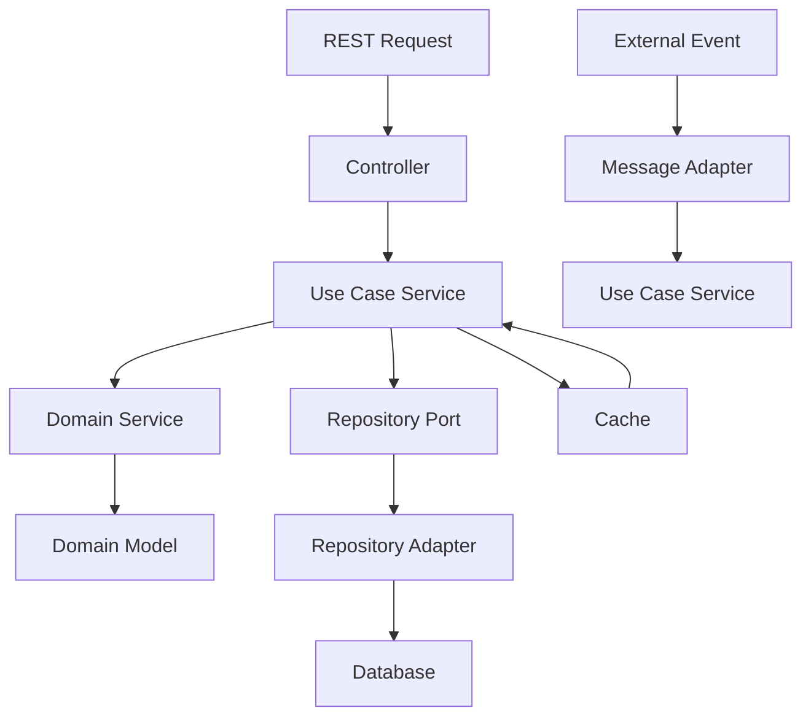

# Xeppelin Ticket System

A comprehensive ticket reservation and management system built with **Spring Boot 3.4.6** and **Java 21**, following **Hexagonal Architecture** principles and implementing modern cloud-native patterns.

## 🎯 Project Overview

The Xeppelin Ticket System is a robust, enterprise-grade platform designed for managing events and ticket reservations. It provides a complete solution for event organizers to create, manage, and monitor their events while offering attendees a seamless ticket purchasing experience.

### Key Features

- **Event Management**: Complete CRUD operations for events with lifecycle management
- **Ticket Reservation System**: Advanced reservation mechanism with session-based cart management
- **Real-time Availability**: Redis-powered caching for instant ticket availability updates
- **QR Code Generation**: Secure ticket validation with QR codes
- **User Management**: Role-based access control for organizers and attendees
- **REST API**: Comprehensive RESTful API with OpenAPI 3.0 documentation
- **Observability**: Full observability stack with metrics, tracing, and logging
- **Cloud-Ready**: Containerized with optimized buildpacks for production deployment

## 🏗️ Architecture

### Hexagonal Architecture (Ports & Adapters)

The system follows clean architecture principles with clear separation of concerns:

```
src/main/java/com/xeppelin/ticketsystem/
├── application/           # Application Layer
│   ├── port/
│   │   ├── input/        # Use Case Interfaces (Primary Ports)
│   │   │   ├── EventManagementUseCase.java
│   │   │   ├── TicketReservationUseCase.java
│   │   │   └── UserManagementUseCase.java
│   │   └── output/       # Repository Interfaces (Secondary Ports)
│   │       ├── EventRepositoryPort.java
│   │       ├── UserRepositoryPort.java
│   │       ├── TicketRepositoryPort.java
│   │       └── NotificationPort.java
│   └── service/          # Use Case Implementations
│       ├── EventManagementService.java
│       ├── TicketReservationService.java
│       └── UserManagementService.java
├── domain/               # Domain Layer (Core Business Logic)
│   ├── model/           # Domain Entities & Value Objects
│   │   ├── Event.java
│   │   ├── User.java
│   │   ├── TicketType.java
│   │   ├── TicketReservation.java
│   │   ├── Ticket.java
│   │   └── QrCode.java
│   ├── service/         # Domain Services
│   │   ├── impl/
│   │   │   ├── EventValidationService.java
│   │   │   ├── TicketPricingService.java
│   │   │   └── QrCodeGenerationService.java
│   │   └── EventDomainService.java
│   └── exception/       # Domain Exceptions
│       ├── EventNotFoundException.java
│       ├── TicketNotAvailableException.java
│       └── InvalidReservationException.java
└── infrastructure/      # Infrastructure Layer
    ├── adapter/
    │   ├── input/       # Primary Adapters
    │   │   ├── rest/    # REST Controllers
    │   │   │   ├── IEventController.java
    │   │   │   ├── ITicketTypeController.java
    │   │   │   ├── impl/
    │   │   │   ├── mapper/
    │   │   │   ├── request/
    │   │   │   ├── response/
    │   │   │   ├── validation/
    │   │   │   └── exception/
    │   │   └── messaging/ # Event Subscribers
    │   └── output/      # Secondary Adapters
    │       ├── persistence/ # Database Adapters
    │       │   ├── adapter/
    │       │   ├── entity/
    │       │   ├── mapper/
    │       │   └── repository/
    │       ├── client/  # External API Clients
    │       └── messaging/ # Event Publishers
    └── config/          # Configuration Classes
        ├── DatabaseConfig.java
        ├── RedisConfig.java
        ├── SecurityConfig.java
        └── OpenApiConfiguration.java
```

### Architecture Principles

#### 1. **Domain-Driven Design (DDD)**
- **Entities**: Core business objects with identity (`Event`, `User`, `Ticket`)
- **Value Objects**: Immutable objects without identity (`QrCode`, `Price`)
- **Aggregates**: Consistency boundaries around related entities
- **Domain Services**: Business logic that doesn't belong to a specific entity
- **Repositories**: Data access abstraction

#### 2. **Dependency Inversion**
- **High-level modules** don't depend on low-level modules
- **Both depend on abstractions** (interfaces/ports)
- **Infrastructure depends on domain**, not vice versa

#### 3. **Interface Segregation**
- **Specific interfaces** for each use case
- **Clients depend only** on interfaces they use
- **Small, focused ports** instead of large interfaces

#### 4. **Single Responsibility**
- **Each layer** has one reason to change
- **Each class** has one responsibility
- **Clear separation** of concerns

### Data Flow & Processing



### Core Patterns Implemented

#### 1. **Repository Pattern**
```java
// Port (Interface)
public interface EventRepositoryPort {
    Event save(Event event);
    Optional<Event> findById(UUID id);
    Page<Event> findPublishedEvents(Pageable pageable);
}

// Adapter (Implementation)
@Repository
public class EventRepositoryAdapter implements EventRepositoryPort {
    // JPA implementation
}
```

#### 2. **Use Case Pattern**
```java
// Port (Interface)
public interface EventManagementUseCase {
    Event createEvent(UUID organizerId, Event event);
    Event updateEvent(UUID organizerId, UUID eventId, Event event);
}

// Service (Implementation)
@Service
public class EventManagementService implements EventManagementUseCase {
    // Business logic implementation
}
```

#### 3. **Mapper Pattern**
```java
@Mapper(componentModel = "spring")
public interface EventRestMapper {
    Event fromCreateRequestToEvent(CreateEventRequest request);
    EventResponse fromEventToEventResponse(Event event);
}
```

### Technology Stack

#### Core Framework
- **Spring Boot 3.4.6** - Main framework with auto-configuration
  - Spring Web MVC for REST endpoints
  - Spring Security for authentication/authorization
  - Spring Data JPA for database operations
  - Spring Cache for caching abstraction
  - Spring Validation for request validation
- **Java 21** - Programming language with modern features
  - Records for immutable DTOs
  - Pattern matching and sealed classes
  - Virtual threads support (Project Loom)
  - Enhanced switch expressions
- **Spring Data JPA 3.2.x** - Data persistence layer
  - Hibernate 6.4.x as JPA provider
  - Custom query methods with @Query
  - Pageable support for large datasets
  - Entity lifecycle callbacks
- **Spring Validation** - Request validation
  - Bean Validation (JSR-380) with Hibernate Validator
  - Custom validation annotations
  - Method-level validation
- **Flyway 10.x** - Database migrations
  - Version-controlled schema changes
  - SQL and Java-based migrations
  - Environment-specific migration support

#### Database & Caching
- **PostgreSQL 16** - Primary database
  - JSONB support for flexible data structures
  - Full-text search capabilities
  - Advanced indexing strategies
  - Connection pooling with HikariCP
- **Redis 7.x** - Caching and session management
  - Distributed caching with TTL
  - Session storage for scalability
  - Rate limiting implementation
  - Pub/Sub for real-time notifications
- **HikariCP 5.x** - High-performance connection pooling
  - Optimized for low latency
  - Connection leak detection
  - Health checks and monitoring

#### Documentation & API
- **SpringDoc OpenAPI 3.0** - API documentation
  - Interactive Swagger UI
  - OpenAPI 3.0 specification generation
  - Custom operation documentation
  - Security scheme definitions
- **MapStruct 1.5.x** - Object mapping
  - Compile-time code generation
  - Type-safe mappings
  - Custom mapping methods
  - Integration with Spring dependency injection
- **Lombok 1.18.x** - Code generation
  - Reduces boilerplate code
  - Builder patterns
  - Logging annotations
  - Data class generation

#### Observability & Monitoring
- **Micrometer 1.12.x** - Metrics collection
  - Timer, Counter, Gauge metrics
  - Custom business metrics
  - Integration with monitoring systems
- **OpenTelemetry 1.32.x** - Distributed tracing
  - Automatic instrumentation
  - Custom spans and traces
  - Correlation ID propagation
- **Prometheus** - Metrics storage and alerting
  - Time-series database
  - PromQL query language
  - Alerting rules configuration
- **Grafana** - Observability dashboard
  - Custom dashboards for business metrics
  - Alert notifications
  - Data source integrations
- **Loki** - Log aggregation
  - Centralized logging
  - LogQL for log queries
  - Integration with Grafana

#### Testing Framework
- **JUnit 5** - Unit testing framework
  - Parameterized tests
  - Test lifecycle management
  - Assertions and assumptions
- **Spring Boot Test** - Integration testing
  - @SpringBootTest for full context loading
  - @WebMvcTest for controller testing
  - @DataJpaTest for repository testing
- **Testcontainers** - Integration testing with real databases
  - PostgreSQL containers for testing
  - Redis containers for cache testing
  - Network isolation and cleanup
- **Mockito 5.x** - Mocking framework
  - Mock dependencies in unit tests
  - Argument captor verification
  - Spy objects for partial mocking
- **AssertJ** - Fluent assertions
  - Readable test assertions
  - Custom assertion methods
  - Exception assertions

#### Build & Deployment
- **Gradle 8.14** - Build automation tool
  - Multi-project builds
  - Dependency management
  - Custom tasks and plugins
  - Build cache optimization
- **Buildpacks** - Container image creation
  - Cloud Native Buildpacks
  - Optimized layer caching
  - Security scanning integration
  - Multi-stage builds
- **Docker & Docker Compose** - Containerization
  - Development environment setup
  - Service orchestration
  - Volume management
  - Network configuration
- **GitHub Actions** - CI/CD pipeline
  - Automated testing
  - Code quality checks
  - Container image building
  - Deployment automation

#### Development Tools
- **Spring Boot DevTools** - Development productivity
  - Automatic application restart
  - LiveReload support
  - Property defaults for development
- **Spring Boot Configuration Processor** - Configuration metadata
  - IDE autocompletion for properties
  - Configuration property documentation
- **Gradle Wrapper** - Build tool version management
  - Consistent build environment
  - Version locking
  - Distribution caching

## 🚀 Quick Start

### Prerequisites

- **Java 21** or higher
- **Docker & Docker Compose**
- **Gradle 8.14** (included via wrapper)

### Local Development Setup

1. **Clone the repository**
   ```bash
   git clone <repository-url>
   cd ticket-system
   ```

2. **Start infrastructure services**
   ```bash
   # Start PostgreSQL and Redis
   docker-compose up -d postgres redis
   ```

3. **Run the application**
   ```bash
   ./gradlew bootRun
   ```

4. **Access the application**
   - **API Base URL**: http://localhost:9001/api/ticket-system
   - **API Documentation**: http://localhost:9001/api/ticket-system/swagger-ui.html
   - **Health Check**: http://localhost:9001/api/ticket-system/admin/health

### Full Stack Deployment

```bash
# Build optimized container image
./build-buildpack.sh

# Start complete stack
docker-compose up -d

# View logs
docker-compose logs -f ticket-system
```

## 📊 Database Schema

The system uses a comprehensive database schema with the following main entities:

- **USERS** - System users (organizers and attendees)
- **EVENTS** - Event information and lifecycle management
- **TICKET_TYPES** - Different ticket categories for events
- **TICKET_RESERVATIONS** - Temporary reservations during purchase
- **TICKETS** - Purchased tickets
- **QR_CODES** - Ticket validation codes
- **TICKET_VALIDATIONS** - Ticket validation history

For detailed ER diagram, see [ER_Diagram_TicketSystem.md](ER_Diagram_TicketSystem.md)

## 🔌 API Documentation

### API Endpoints Overview

#### Organizer Operations
- `POST /events/organizers/{organizerId}` - Create event
- `GET /events/organizers/{organizerId}` - List organizer events
- `GET /events/{eventId}/organizers/{organizerId}` - Get specific event
- `PUT /events/{eventId}/organizers/{organizerId}` - Update event
- `DELETE /events/{eventId}/organizers/{organizerId}` - Delete event

#### Public Operations
- `GET /events` - List published events
- `GET /events/search` - Search events
- `GET /events/{eventId}` - Get event details

### Request/Response Examples

#### Create Event
```bash
curl -X POST "http://localhost:9001/api/ticket-system/events/organizers/{organizerId}" \
  -H "Content-Type: application/json" \
  -d '{
    "name": "Spring Conference 2024",
    "start": "2024-12-15T20:00:00+01:00[Europe/Madrid]",
    "end": "2024-12-15T23:00:00+01:00[Europe/Madrid]",
    "venue": "Madrid Convention Center",
    "salesStart": "2024-11-01T10:00:00+01:00[Europe/Madrid]",
    "salesEnd": "2024-12-15T19:00:00+01:00[Europe/Madrid]"
  }'
```

**Response (HTTP 201):**
```json
{
  "id": "123e4567-e89b-12d3-a456-426614174001",
  "name": "Spring Conference 2024",
  "start": "2024-12-15T20:00:00+01:00[Europe/Madrid]",
  "end": "2024-12-15T23:00:00+01:00[Europe/Madrid]",
  "venue": "Madrid Convention Center",
  "salesStart": "2024-11-01T10:00:00+01:00[Europe/Madrid]",
  "salesEnd": "2024-12-15T19:00:00+01:00[Europe/Madrid]",
  "status": "DRAFT",
  "organizer": {
    "id": "123e4567-e89b-12d3-a456-426614174000",
    "name": "John Doe",
    "email": "john.doe@example.com"
  },
  "attendees": [],
  "staff": [],
  "ticketTypes": []
}
```

For complete API documentation, see [EVENT_API_DOCUMENTATION.md](EVENT_API_DOCUMENTATION.md)

## �� Configuration

### Environment Variables Reference

The application can be configured through environment variables for different deployment scenarios:

#### Database Configuration
```yaml
# PostgreSQL Database
DB_HOST=localhost                    # Database host
DB_PORT=5432                        # Database port
DB_NAME=ticket_db                   # Database name
DB_USER=user                        # Database username
DB_PASSWORD=password                # Database password
DB_POOL_SIZE=10                     # Connection pool size
DB_IDLE_TIMEOUT=600000              # Idle connection timeout (ms)
DB_MAX_LIFETIME=1800000             # Maximum connection lifetime (ms)
```

#### Redis Configuration
```yaml
# Redis Cache & Session Store
REDIS_HOST=localhost                # Redis host
REDIS_PORT=6379                     # Redis port
REDIS_PASSWORD=                     # Redis password (optional)
REDIS_TIMEOUT=2000                  # Connection timeout (ms)
REDIS_CONNECT_TIMEOUT=2000          # Connect timeout (ms)
REDIS_TTL=3600                      # Default cache TTL (seconds)
```

#### Observability Configuration
```yaml
# OpenTelemetry & Monitoring
OTEL_EXPORTER_OTLP_ENDPOINT=http://otel-collector:4318
OTEL_EXPORTER_OTLP_HEADERS=         # Optional auth headers
ENVIRONMENT=development             # Environment name for metrics
LOG_LEVEL=INFO                      # Application log level
OTEL_SAMPLING_PROBABILITY=1.0       # Trace sampling rate (0.0-1.0)
```

#### Security Configuration
```yaml
# Authentication & Authorization
JWT_SECRET=your-secret-key          # JWT signing secret
JWT_EXPIRATION=86400               # JWT expiration (seconds)
CORS_ALLOWED_ORIGINS=http://localhost:3000,http://localhost:8080
CORS_ALLOWED_METHODS=GET,POST,PUT,DELETE,OPTIONS
CORS_ALLOWED_HEADERS=*
CORS_ALLOW_CREDENTIALS=true
```

#### Business Logic Configuration
```yaml
# Application-specific settings
APP_NAME=Ticket System
APP_VERSION=1.0.0
SERVER_PORT=9001
CONTEXT_PATH=/api/ticket-system
MANAGEMENT_PORT=9001               # Actuator endpoints port
```

### Application Properties (application.yml)

#### Complete Configuration Example
```yaml
server:
  port: ${SERVER_PORT:9001}
  shutdown: graceful
  servlet:
    context-path: ${CONTEXT_PATH:/api/ticket-system}
  tomcat:
    connection-timeout: 1s
    keep-alive-timeout: 15s
    threads:
      max: 100
      min-spare: 20
    max-connections: 10000
    accept-count: 100
    max-swallow-size: 2MB
    max-http-form-post-size: 2MB

spring:
  application:
    name: ${APP_NAME:ticket-system}
  
  # Profile-specific configurations
  profiles:
    active: ${SPRING_PROFILES_ACTIVE:development}
  
  # JSON Configuration
  jackson:
    visibility:
      getter: none
      is-getter: none
      field: any
      setter: none
    default-property-inclusion: non_empty
    serialization:
      write-dates-as-timestamps: false
      indent-output: true
    deserialization:
      adjust-dates-to-context-time-zone: false
      fail-on-unknown-properties: false
    time-zone: UTC
    date-format: "yyyy-MM-dd'T'HH:mm:ssXXX'['VV']'"
  
  # Database Configuration
  datasource:
    url: jdbc:postgresql://${DB_HOST:localhost}:${DB_PORT:5432}/${DB_NAME:ticket_db}
    username: ${DB_USER:user}
    password: ${DB_PASSWORD:password}
    driver-class-name: org.postgresql.Driver
    hikari:
      maximum-pool-size: ${DB_POOL_SIZE:10}
      minimum-idle: 5
      idle-timeout: ${DB_IDLE_TIMEOUT:600000}
      max-lifetime: ${DB_MAX_LIFETIME:1800000}
      connection-test-query: SELECT 1
      pool-name: TicketSystemHikariCP
      auto-commit: false
      
  # JPA Configuration
  jpa:
    hibernate:
      ddl-auto: validate
      naming:
        physical-strategy: org.hibernate.boot.model.naming.CamelCaseToUnderscoresNamingStrategy
    properties:
      hibernate:
        format_sql: true
        jdbc:
          batch_size: 50
          fetch_size: 25
        order_inserts: true
        order_updates: true
        generate_statistics: ${HIBERNATE_STATISTICS:false}
        cache:
          use_second_level_cache: true
          use_query_cache: true
          region:
            factory_class: org.hibernate.cache.jcache.JCacheRegionFactory
    show-sql: ${HIBERNATE_SHOW_SQL:false}
    open-in-view: false
    
  # Flyway Configuration
  flyway:
    enabled: true
    locations: classpath:db/migration
    clean-disabled: true
    out-of-order: ${FLYWAY_OUT_OF_ORDER:false}
    ignore-migration-patterns: '*:ignored'
    baseline-on-migrate: true
    validate-on-migrate: true
    
  # Redis Configuration
  data:
    redis:
      host: ${REDIS_HOST:localhost}
      port: ${REDIS_PORT:6379}
      password: ${REDIS_PASSWORD:}
      timeout: ${REDIS_TIMEOUT:2000ms}
      connect-timeout: ${REDIS_CONNECT_TIMEOUT:2000ms}
      client-type: lettuce
      lettuce:
        pool:
          max-active: 8
          max-idle: 8
          min-idle: 0
          max-wait: -1ms
          
  # Cache Configuration
  cache:
    type: redis
    redis:
      time-to-live: ${REDIS_TTL:3600}
      cache-null-values: false
      use-key-prefix: true
      key-prefix: "ticket_system:"
      
  # Security Configuration
  security:
    oauth2:
      resourceserver:
        jwt:
          issuer-uri: ${JWT_ISSUER_URI:}
          jwk-set-uri: ${JWT_JWK_SET_URI:}

# Management & Monitoring
management:
  endpoints:
    web:
      base-path: /admin
      exposure:
        include: refresh, configprops, env, flyway, health, metrics, heapdump, info, loggers, mappings, prometheus, caches
  
  health:
    readiness-state:
      enabled: true
    liveness-state:
      enabled: true
    redis:
      enabled: true
    db:
      enabled: true
    disk-space:
      enabled: true
      threshold: 100MB
      
  endpoint:
    shutdown:
      access: unrestricted
    health:
      show-details: always
      show-components: always
      probes:
        enabled: true
      group:
        readiness:
          include: db, redis, diskSpace
        liveness:
          include: ping, diskSpace
          
  info:
    env:
      enabled: true
    java:
      enabled: true
    os:
      enabled: true
    git:
      mode: full
      
  metrics:
    tags:
      application: ${spring.application.name}
      service: ${spring.application.name}
      environment: ${ENVIRONMENT:development}
      version: ${APP_VERSION:unknown}
    distribution:
      percentiles-histogram:
        http.server.requests: true
        jdbc.connections.acquire: true
      percentiles:
        http.server.requests: 0.5, 0.9, 0.95, 0.99
        jdbc.connections.acquire: 0.5, 0.9, 0.95, 0.99
    export:
      prometheus:
        enabled: true
        step: 10s
      otlp:
        enabled: true
        url: ${OTEL_EXPORTER_OTLP_ENDPOINT:http://otel-collector:4318/v1/metrics}
        headers:
          Authorization: ${OTEL_EXPORTER_OTLP_HEADERS:}
        step: 10s
        
  tracing:
    enabled: true
    sampling:
      probability: ${OTEL_SAMPLING_PROBABILITY:1.0}
    export:
      otlp:
        endpoint: ${OTEL_EXPORTER_OTLP_ENDPOINT:http://otel-collector:4318}
    propagation:
      consume: b3, w3c
      produce: b3, w3c

# Logging Configuration
logging:
  level:
    root: INFO
    com.xeppelin: ${LOG_LEVEL:INFO}
    org.springframework: INFO
    org.hibernate: INFO
    org.springframework.security: ${SECURITY_LOG_LEVEL:INFO}
    org.springframework.web: ${WEB_LOG_LEVEL:INFO}
  pattern:
    level: "%5p [${spring.application.name},%X{traceId:-},%X{spanId:-}]"
    console: "%d{yyyy-MM-dd HH:mm:ss.SSS} %5p [${spring.application.name},%X{traceId:-},%X{spanId:-}] %c{1} : %m%n"
    file: "%d{yyyy-MM-dd HH:mm:ss.SSS} %5p [${spring.application.name},%X{traceId:-},%X{spanId:-}] %c{1} : %m%n"
  logback:
    rollingpolicy:
      max-file-size: 100MB
      max-history: 30

# OpenAPI Documentation
springdoc:
  swagger-ui:
    path: /swagger-ui.html
    enabled: true
    try-it-out-enabled: true
    operations-sorter: method
    tags-sorter: alpha
    filter: true
    display-request-duration: true
    display-operation-id: true
    show-extensions: true
    show-common-extensions: true
    default-models-expand-depth: 1
    default-model-expand-depth: 1
    doc-expansion: none
    persist-authorization: true
    config-url: /v3/api-docs/swagger-config
    url: /v3/api-docs
  api-docs:
    path: /v3/api-docs
    enabled: true
    resolve-schema-properties: true
  show-actuator: false
  group-configs:
    - group: 'event-management'
      display-name: 'Event Management API'
      paths-to-match: '/events/**'
    - group: 'ticket-management'
      display-name: 'Ticket Management API'
      paths-to-match: '/ticket-types/**'
  default-consumes-media-type: application/json
  default-produces-media-type: application/json
  writer-with-default-pretty-printer: true

# Application Business Logic Configuration
app:
  ticket:
    reservation:
      max-reservations-per-session: ${MAX_RESERVATIONS_PER_SESSION:5}
      max-quantity-per-reservation: ${MAX_QUANTITY_PER_RESERVATION:10}
      max-extension-duration: ${MAX_EXTENSION_DURATION:PT1H}        # ISO-8601 duration format (1 hour)
      default-reservation-duration: ${DEFAULT_RESERVATION_DURATION:PT15M}  # ISO-8601 duration format (15 minutes)
      expiration-grace-period: ${EXPIRATION_GRACE_PERIOD:PT1M}       # ISO-8601 duration format (1 minute)
      cleanup-interval: ${CLEANUP_INTERVAL:PT5M}                    # Cleanup job interval
  
  event:
    validation:
      max-duration-hours: ${MAX_EVENT_DURATION:168}                 # Maximum event duration (7 days)
      min-sales-period-hours: ${MIN_SALES_PERIOD:1}                # Minimum sales period (1 hour)
      max-future-months: ${MAX_FUTURE_MONTHS:12}                   # Maximum future event date (12 months)
  
  qr:
    code:
      algorithm: ${QR_ALGORITHM:AES}                               # QR code encryption algorithm
      secret: ${QR_SECRET:your-qr-secret-key}                     # QR code encryption secret
      expiration-hours: ${QR_EXPIRATION:24}                       # QR code validity (24 hours)
  
  notification:
    email:
      enabled: ${EMAIL_NOTIFICATIONS:true}
      smtp:
        host: ${SMTP_HOST:localhost}
        port: ${SMTP_PORT:587}
        username: ${SMTP_USERNAME:}
        password: ${SMTP_PASSWORD:}
        from: ${EMAIL_FROM:noreply@xeppelin.com}
    
  cors:
    allowed-origins: ${CORS_ALLOWED_ORIGINS:http://localhost:3000,http://localhost:8080}
    allowed-methods: ${CORS_ALLOWED_METHODS:GET,POST,PUT,DELETE,OPTIONS}
    allowed-headers: ${CORS_ALLOWED_HEADERS:*}
    allow-credentials: ${CORS_ALLOW_CREDENTIALS:true}
    max-age: ${CORS_MAX_AGE:3600}
```

### Profile-Specific Configurations

#### Development Profile (application-development.yml)
```yaml
spring:
  jpa:
    show-sql: true
    properties:
      hibernate:
        format_sql: true
        generate_statistics: true
  
logging:
  level:
    com.xeppelin: DEBUG
    org.springframework.web: DEBUG
    org.hibernate.SQL: DEBUG
    org.hibernate.type.descriptor.sql.BasicBinder: TRACE

app:
  ticket:
    reservation:
      default-reservation-duration: PT30M  # Longer for development
```

#### Production Profile (application-production.yml)
```yaml
spring:
  jpa:
    show-sql: false
    properties:
      hibernate:
        generate_statistics: false
  
logging:
  level:
    com.xeppelin: INFO
    org.springframework: WARN

app:
  ticket:
    reservation:
      default-reservation-duration: PT10M  # Shorter for production
```

#### Testing Profile (application-test.yml)
```yaml
spring:
  datasource:
    url: jdbc:h2:mem:testdb
    driver-class-name: org.h2.Driver
  jpa:
    hibernate:
      ddl-auto: create-drop
  
app:
  ticket:
    reservation:
      default-reservation-duration: PT1M   # Very short for tests
```

## 🏃‍♂️ Development

### Code Style & Conventions

- **Java 21** features with modern syntax
- **Spring Boot 3.x** best practices
- **Constructor injection** over field injection
- **Record classes** for DTOs
- **Lombok** annotations for boilerplate reduction
- **MapStruct** for object mapping

### Project Structure Guidelines

#### Application Layer
- **Use Cases** define business operations interfaces
- **Services** implement business logic
- **Ports** define infrastructure contracts

#### Domain Layer
- **Models** contain core business entities
- **Domain Services** handle complex business rules
- **Exceptions** define domain-specific errors

#### Infrastructure Layer
- **REST Controllers** handle HTTP concerns only
- **Repositories** implement data persistence
- **Mappers** convert between layers

### Testing Strategy

#### Unit Tests
```bash
./gradlew test
```

#### Integration Tests
```bash
./gradlew integrationTest
```

#### Test with Testcontainers
```bash
./gradlew testWithContainers
```

### Build & Deployment

#### Fast Development Build
```bash
./build-buildpack.sh --dev  # 15-30 seconds
```

#### Complete Build
```bash
./build-buildpack.sh        # 1-3 minutes
```

#### Clean Build
```bash
./build-buildpack.sh --clean  # 2-3 minutes
```

For optimization details, see [DOCKER_BUILD_OPTIMIZATION.md](DOCKER_BUILD_OPTIMIZATION.md)

## 📈 Monitoring & Observability

### Health Checks
- **Application Health**: `/admin/health`
- **Database Health**: `/admin/health/db`
- **Redis Health**: `/admin/health/redis`

### Metrics
- **Application Metrics**: `/admin/metrics`
- **Prometheus Endpoint**: `/admin/prometheus`
- **Custom Business Metrics**: Event creation, ticket sales, etc.

### Tracing
- **OpenTelemetry** integration
- **Distributed tracing** across services
- **Performance monitoring**

### Logging
- **Structured logging** with JSON format
- **Correlation IDs** for request tracing
- **Log aggregation** with ELK stack

## 🛠️ Tools & Utilities

### Postman Collection
Complete API testing collection available:
- **File**: `Ticket_System_Postman_Collection.json`
- **Documentation**: [POSTMAN_COLLECTION_README.md](POSTMAN_COLLECTION_README.md)

### Database Migrations
```bash
# Check migration status
./gradlew flywayInfo

# Apply migrations
./gradlew flywayMigrate

# Validate migrations
./gradlew flywayValidate
```

### Development Scripts
- `create_structure.sh` - Generate project structure
- `build-buildpack.sh` - Optimized container builds
- `build-fast.sh` - Quick development builds

## 👥 Team

**Xeppelin Development Team**

For support and questions, please contact the development team or create an issue in the repository.

---

**Version**: 0.0.1-SNAPSHOT  
**Last Updated**: December 2024  
**Spring Boot Version**: 3.4.6  
**Java Version**: 21
